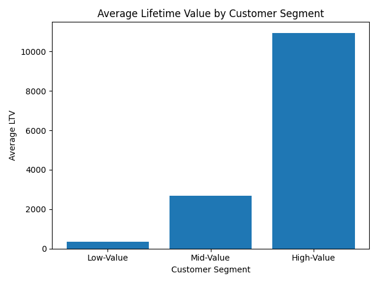
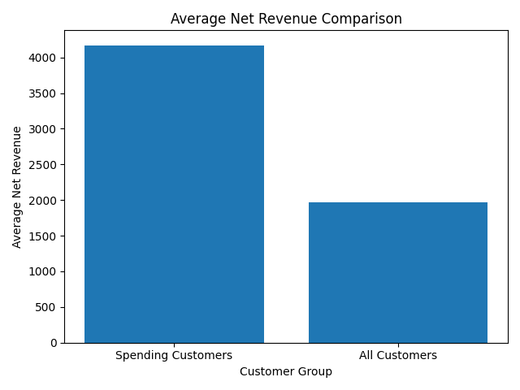
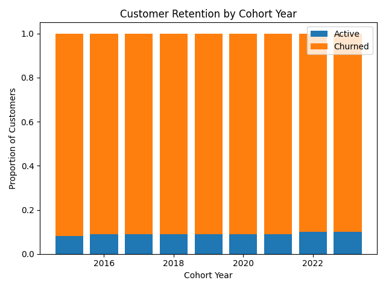

# 📊 Customer Segmentation, Cohorts & Retention Analytics

### 📌 Project Overview

This repository presents an end-to-end SQL-based data analysis project built on a star-schema data model, focusing on customer segmentation, cohort analysis, and retention metrics.

### 🔁 Analytical View: cohort_analysis
**Purpose**

The `cohort_analysis` view serves as the analytical transformation layer for the project. It consolidates transactional and customer data into a customer–date grain, enabling efficient downstream analytics such as segmentation, cohort analysis, and retention tracking.

**Key Transformations**

- Aggregates transactional revenue at customer + order date level

- Computes total net revenue per day per customer

- Derives first purchase date per customer

- Assigns a cohort year based on first purchase

- Cleans and standardizes customer names

**Why This Matters (Data Engineering Perspective)**

- Avoids duplication of business logic

- Improves query readability and maintainability

- Mimics a Gold-layer analytical view in a modern data platform

### Q1️⃣ Customer Segmentation (Lifetime Value Based)

`File: Q1_Customer_Segmentation.sql`

**Business Question**

How can customers be segmented based on their `lifetime value (LTV)`?

**Methodology**

- Aggregate total net revenue per customer using the cohort_analysis view

- Compute `25th and 75th percentiles` of customer LTV

- Assign customers into three value-based segments:

   - Low Value

  - Mid Value

  - High Value

- Summarize LTV distribution per segment

**Output Metrics**

- Total lifetime value per segment

- Number of customers per segment

- Average LTV per customer

**Why This Is Valuable**

- Enables targeted marketing strategies

- Identifies high-impact customers

- Demonstrates percentile-based segmentation (industry-standard approach)

### Q2️⃣ Cohort Analysis & Revenue Benchmarking

`File: Q2_Cohort_Analysis.sql`

### Part A: Cohort Revenue Performance
**Business Question**

How do customer cohorts perform in terms of revenue at acquisition time?

**Methodology**

- Filter customers to their first purchase date

- Group customers by cohort year

- Calculate:

  - Total customers

  - Total revenue

  - Average revenue per customer

### Part B: Spending Behavior Comparison
**Business Question**

How does average spending differ between:

- Customers who made purchases

- All registered customers (including non-spenders)?

**Methodology**

- Aggregate net revenue at customer level

- LEFT JOIN against the full customer table

- Compare averages including and excluding zero-spend customers

**Why This Matters**

- Identifies revenue concentration

- Highlights inactive customer population

- Aligns with real-world KPI analysis used in growth analytics

### Q3️⃣ Customer Retention & Churn Analysis

`File: Q3_Customer_Retention.sql`

**Business Question**

How many customers remain active vs churned across cohorts?

**Definition**

- Active: Purchased within the last 6 months

- Churned: No purchase in the last 6 months

**Methodology**

- Identify each customer’s most recent purchase

- Classify customers as Active or Churned

- Aggregate retention metrics by cohort year

- Calculate retention percentages using window functions

**Key Outputs**

- Number of active vs churned customers per cohort

- Retention percentage per cohort year

**Why This Is Strong**

- Uses window functions and temporal logic

- Matches real-world churn definitions

- Suitable for dashboarding and KPI tracking

# 📌 Key Insights

- High-value customers represent a smaller segment but contribute the majority of lifetime revenue.
- Average revenue from spending customers is more than double the overall customer average, highlighting a large inactive customer base.
- Customer churn remains consistently high across cohorts, with only ~9–10% of customers remaining active after six months.

# 🛠 Tools & Technologies

Database Tool: DBeaver

Language: SQL

Version Control: Git & GitHub

Editor: Visual Studio Code

ChatGPT for visualization and polishing the files

# 📬 Contact

Feel free to connect with me on GitHub for feedback, collaboration, or discussion.